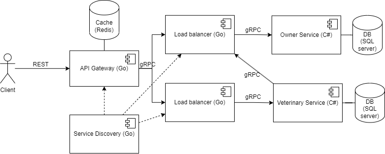

# Laboratory work nr. 1 on Distributed Systems Programming

## Setup

- Install [Docker](https://docs.docker.com/engine/install/)
- Make sure kubernetes is turned on in docker (Settings -> Kubernetes -> Enable -> Apply)
- Install [Linkerd](https://linkerd.io/2.14/getting-started/) (for load balancing)

Run the commands

```ps
linkerd install --crds | kubectl apply -f -
linkerd install --set proxyInit.runAsRoot=true | kubectl apply -f -
```

## Start the app

```ps
linkerd inject k8s.yaml | kubectl apply -f -
```

Enjoy.

## Stop the app

```ps
linkerd uninject k8s.yaml | kubectl delete -f -
```

## Veterinary clinics services and pet data management

Distributed app for veterinary clinics and pet data management. Includes pet registration, appointments, notifications/emails about pet vaccination, pet records update after each consultation.

## Application Suitability

Microservice architecture is suitable for veterinary clinic services and pet data management. These are the main pros for a microservice architecture:

- Microservices allow for individual components to scale independently. If the veterinary clinic's services and pet data management require scalability due to varying loads, microservices can be beneficial.

- Microservices offer flexibility in technology choices for each service. This can be helpful if different aspects of the application require different technologies or updates.

- Isolating different functions or services can enhance security. For example, you might want to separate sensitive pet health data.

- Microservices can make it easier to maintain and update specific components of the application without affecting the entire system. This can be advantageous for a long-term project.
- If you need to integrate with external systems like governmental services or payments, having independent microservices can make it easier to manage these integrations without affecting the entire system.

## Service boundaries

## Technology Stack and Communication Patterns

The services will be written in C# and will use SQL server as a database. The API Gateway, Service Discovery and Load Balancers will be written in Go. Additionally, the API Gateway will have a cache in Redis.

The communication between client and API Gateway will be done using REST while the communication between services will be done via gRPC.
## Data Management
The Owner Service and Veterinary service will have their own databases. The Gateway will have a Redis Cache to return some cached requests. All messages wil be in JSON format.

## Endpoints

### Status endpoint

Health check endpoint for all services
```
Endpoint: /status
Method: GET
Response: 200 OK
Response: 503 Service Unavailable
```

### Service Discovery
Endpoint: /registerService
Method: POST
Payload: {
    "name": "vet-service-1",
}

### API Gateway

Owner service endpoints from gateway
```
Endpoint: /register
Method: POST
Payload: {
    "email": "email@asd.com"
}
Response: 201 Created
```

```
Endpoint: /register-pet
Method: POST
Payload: {
    "type": "Dog",
    "race": "Chihuaua",
    "name": "Devil incarnate"
}
Response: 201 Created
```

```
Endpoint: /remove-data/{ownerId}
Method: DELETE
Response: 204 No Content
```

Veterinary service endpoints from gateway
```
Endpoint: /make-appointment
Method: POST
Payload: {
    "petId": 1,
    "dateTime": "2023-28-09T13:00Z"
}
Response: 201 Created
```

```
Endpoint: /end-appointment
Method: POST
Payload: {
    "appointmentId": 1,
    "details: "dog is evil"
}
Response: 201 Created
```

### Load Balancer

```
Endpoint: /addService
Method: POST
Payload: {
    "name": "vet-service-1"
}
Response: 200 OK
```

```
Endpoint: /deleteService
Method: POST
Payload: {
    "name": "vet-service-1"
}
Response: 200 OK
```

```
Endpoint: /forwardRequest
Method: POST
Payload: {
    "endpoint": "/some-endpoint",
    "payload":{some-obj}
}
Response: 200 OK
Response: 404 Not Found
```

### Owner Service

```
Endpoint: /sendNotification
Method: POST
Payload: {
    "type": ["email", "sms"],
    "petIds": [1, 10, 20],
    "message": "vaccinate your pet, you can make an appointment at vet.com"
}
Response: 200 OK
```

## Deployment and Scaling

Containerization (Docker) and orchestration (Kubernetes) will be used for Deployment and Scaling.

## References
1. [Example. ”Microservice Architecture”.](https://microservices.io/i/Microservice_Architecture.png)

2. [AWS. ”What is an API”.](https://aws.amazon.com/what-is/api/)

3. [”API health check”.](https://testfully.io/blog/api-health-check-monitoring/#what-is-an-api-health-check)

4. [”408 Request Timeout”.](https://developer.mozilla.org/en-US/docs/Web/HTTP/Status/408)

5. [Mark Smallcombe. ”SQL vs NoSQL: 5 Critical Differences”.](https://www.xplenty.com/blog/the-sql-vs-nosql-difference)

6. [”About maximum concurrent tasks”.](https://docs.infor.com/ism/5.x/en-us/ism_onlinehelp/lsm1454147676513.html)

7. [”What is a Gateway and What Does it Do?”.](https://whatismyipaddress.com/gateway)

8. [Julien Le Coupanec. ”Redis Cheatsheet - Basic Commands You Must Know”.](https://gist.github.com/LeCoupa/1596b8f359ad8812c7271b5322c30946)

9. [Simone Cusimano. ”Service Discovery in Microservices”.](https://www.baeldung.com/cs/service-discovery-microservices)

10. [”Load Balancing As A Service (LBaaS)”.](https://avinetworks.com/glossary/load-balancing-as-a-service/)

11. [Martin Fowler. ”CircuitBreaker”.](https://martinfowler.com/bliki/CircuitBreaker.html)

12. [Thomas Hamilton. ”Unit Testing Tutorial – What is, Types and Test Example”.](https://www.guru99.com/unit-testing-guide.htmlhttps://www.guru99.com/unit-testing-guide.html)

13. [Thomas Hamilton. ”Integration Testing: What is, Types with Example”.](https://www.guru99.com/integration-testing.html)

14. [Phil Sturgeon. ”Understanding RPC Vs REST For HTTP APIs”.](https://www.smashingmagazine.com/2016/09/understanding-rest-and-rpc-for-http-apis/)

15. [”Pattern: Health Check API”.](https://microservices.io/patterns/observability/health-check-api.html)