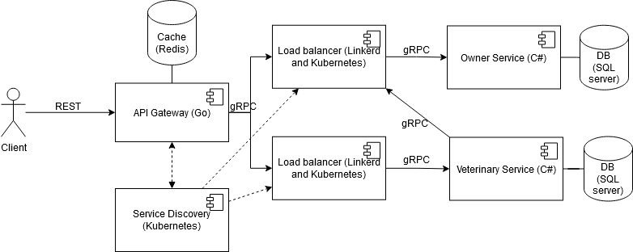

# Laboratory work nr. 1 and 2 on Distributed Systems Programming

## Setup

- Install [Docker](https://docs.docker.com/engine/install/)
- Make sure kubernetes is turned on in docker (Settings -> Kubernetes -> Enable -> Apply)
- Install [Linkerd](https://linkerd.io/2.14/getting-started/) (for load balancing)

Run the commands

```ps
make go_protoc
linkerd install --crds | kubectl apply -f -
linkerd install --set proxyInit.runAsRoot=true | kubectl apply -f -
```

## Start the app

```ps
linkerd inject k8s.yaml | kubectl apply -f -
```

Enjoy.

## Stop the app

```ps
linkerd uninject k8s.yaml | kubectl delete -f -
```

## Run unit tests

```ps
dotnet test OwnerService
```

## Veterinary clinics services and pet data management

Distributed app for veterinary clinics and pet data management. Includes pet registration, appointments, notifications/emails about pet vaccination, pet records update after each consultation.

## Endpoints

[Postman collection](./endpoints.postman_collection.json)

### Status endpoint

Health check endpoint for all services
```
Endpoint: /status
Method: GET
Response: 200 OK
Body: {
    "status": "ok"
}
```

### API Gateway

Owner service endpoints from gateway
```
Endpoint: /api/owner/register
Method: POST
Payload: {
    "email": "email@asd.com"
}
Response: 201 Created
Body: {
    "message": "Register successful",
    "ownerId": "0b2f4780-46f0-4d0f-806a-2b3033f9b285"
}
```

```
Endpoint: /api/owner/register-pet
Method: POST
Payload: {
    "email": "{{email}}",
    "type": "Dog",
    "race": "Chihuaua",
    "name": "Devil incarnate"
}
Response: 201 Created
Body: {
    "message": "Pet Register successful"
}
```

```
Endpoint: /api/owner/{{email}}/pets
Method: GET
Response: 200 OK
Body: {
    "message": "ok",
    "pets": [
        {
            "Type": "Dog",
            "Race": "Chihuaua",
            "Name": "Devil incarnate"
        }
    ]
}
```

```
Endpoint: /api/owner/remove-data/{{email}}
Method: DELETE
Response: 200 OK
Body: {
    "message": "Owner deleted successfully"
}
```

Veterinary service endpoints from gateway
```
Endpoint: /api/veterinary/make-appointment
Method: POST
Payload: {
    "petId": "1",
    "dateTime": "2023-09-09T13:00:00.000Z"
}
Response: 201 Created
Body: {
    "message": "Appointment made"
}
```

```
Endpoint: /end-appointment
Method: POST
Payload: {
    "appointmentId": "73346b7d-288e-4ec3-a801-042576603372",
    "details": "dog is evil"
}
Response: 200 OK
Body: {
    "message": "Appointment ended"
}
```

Test endpoints

```
Endpoint: /api/test/timeout
Method: GET
Response: 408 Request Timeout
Body: {
    "error": "Request timed out"
}
```

```
Spam this until you get 429

Endpoint: /api/test/rate-limit
Method: GET
Response: 429 Too Many Requests
Body: {
    "error": "You're being rate limited"
}
```

```
Endpoint: /api/test/circuit-breaker
Method: GET
Response: 500 Internal Server Error
Body: {
    "error": "Exception thrown on purpose"
}
```

## Application Suitability

Microservice architecture is suitable for veterinary clinic services and pet data management. These are the main pros for a microservice architecture:

- Microservices allow for individual components to scale independently. If the veterinary clinic's services and pet data management require scalability due to varying loads, microservices can be beneficial.

- Microservices offer flexibility in technology choices for each service. This can be helpful if different aspects of the application require different technologies or updates.

- Isolating different functions or services can enhance security. For example, you might want to separate sensitive pet health data.

- Microservices can make it easier to maintain and update specific components of the application without affecting the entire system. This can be advantageous for a long-term project.
- If you need to integrate with external systems like governmental services or payments, having independent microservices can make it easier to manage these integrations without affecting the entire system.

## Service boundaries



## Technology Stack and Communication Patterns

The services will be written in C# and will use SQL server as a database. The API Gateway, Service Discovery and Load Balancers will be written in Go. Additionally, the API Gateway will have a cache in Redis.

The communication between client and API Gateway will be done using REST while the communication between services will be done via gRPC.

## Data Management

The Owner Service and Veterinary service will have their own databases. The Gateway will have a Redis Cache to return some cached requests. All messages wil be in JSON format.

## Deployment and Scaling

Containerization (Docker) and orchestration (Kubernetes) will be used for Deployment and Scaling.

## References
1. [Example. ”Microservice Architecture”.](https://microservices.io/i/Microservice_Architecture.png)

2. [AWS. ”What is an API”.](https://aws.amazon.com/what-is/api/)

3. [”API health check”.](https://testfully.io/blog/api-health-check-monitoring/#what-is-an-api-health-check)

4. [”408 Request Timeout”.](https://developer.mozilla.org/en-US/docs/Web/HTTP/Status/408)

5. [Mark Smallcombe. ”SQL vs NoSQL: 5 Critical Differences”.](https://www.xplenty.com/blog/the-sql-vs-nosql-difference)

6. [”About maximum concurrent tasks”.](https://docs.infor.com/ism/5.x/en-us/ism_onlinehelp/lsm1454147676513.html)

7. [”What is a Gateway and What Does it Do?”.](https://whatismyipaddress.com/gateway)

8. [Julien Le Coupanec. ”Redis Cheatsheet - Basic Commands You Must Know”.](https://gist.github.com/LeCoupa/1596b8f359ad8812c7271b5322c30946)

9. [Simone Cusimano. ”Service Discovery in Microservices”.](https://www.baeldung.com/cs/service-discovery-microservices)

10. [”Load Balancing As A Service (LBaaS)”.](https://avinetworks.com/glossary/load-balancing-as-a-service/)

11. [Martin Fowler. ”CircuitBreaker”.](https://martinfowler.com/bliki/CircuitBreaker.html)

12. [Thomas Hamilton. ”Unit Testing Tutorial – What is, Types and Test Example”.](https://www.guru99.com/unit-testing-guide.htmlhttps://www.guru99.com/unit-testing-guide.html)

13. [Thomas Hamilton. ”Integration Testing: What is, Types with Example”.](https://www.guru99.com/integration-testing.html)

14. [Phil Sturgeon. ”Understanding RPC Vs REST For HTTP APIs”.](https://www.smashingmagazine.com/2016/09/understanding-rest-and-rpc-for-http-apis/)

15. [”Pattern: Health Check API”.](https://microservices.io/patterns/observability/health-check-api.html)

16. [Keyang Xiang. “Patterns for distributed transactions within a microservices architecture.](https://developers.redhat.com/blog/2018/10/01/patterns-for-distributed-transactions-within-a-microservices-architecture)
17. [Ben Lutkevich. “database replication”.](https://searchdatamanagement.techtarget.com/definition/database-replication)
18. [Elasticsearch. “What is the ELK Stack?”.](https://www.elastic.co/what-is/elk-stack)
19. [Cloud Native Computing Foundation. “Prometheus”.](https://prometheus.io)
20. [Grafana Labs. “Grafana”.](https://grafana.com)
21. [Redis. “Replication”.](https://redis.io/topics/replication)
22. [Juan Pablo Carzolio. “The Ultimate Guide to Consistent Hashing”.](https://www.toptal.com/big-data/consistent-hashing)
23. [l3a0. “Distributing a Cache”.](https://blog.baowebdev.com/2019/04/distributing-a-cache)
24. [“What is a data warehouse”.](https://www.ibm.com/topics/data-warehouse)